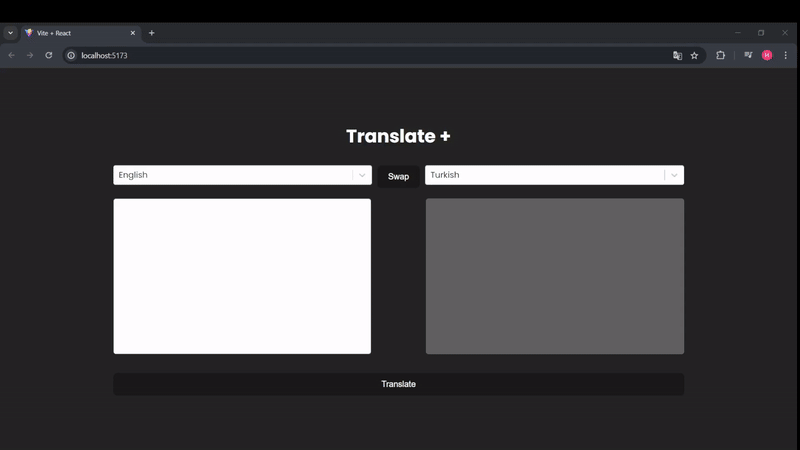

<h1>TRANSLATOR-WEB</h1> 

This project is a multilingual translator web application developed using React, Redux, and Redux Thunk. It allows users to translate text between various languages with ease, providing a responsive and user-friendly interface.
 

<h2>Features</h2> 

<ul> 
    <li>Developed using the React library for building interactive user interfaces.</li> 
    <li>State management handled efficiently with Redux, enabling a centralized store for the application's data/</li> 
    <li>Utilizes Redux Thunk middleware for managing asynchronous operations like API requests for translations.</li>
    <li>SCSS used for styling, providing a modular and maintainable approach to CSS.</li> 
    <li>Responsive design ensuring compatibility across different screen sizes and devices.</li> 
    <li>Comprehensive testing of components to ensure reliability and performance.</li> 
    <li>Supports multiple languages for translation, providing flexibility for diverse user needs.</li> 
    
</ul> 
    
<h2>Screen Gif</h2>

